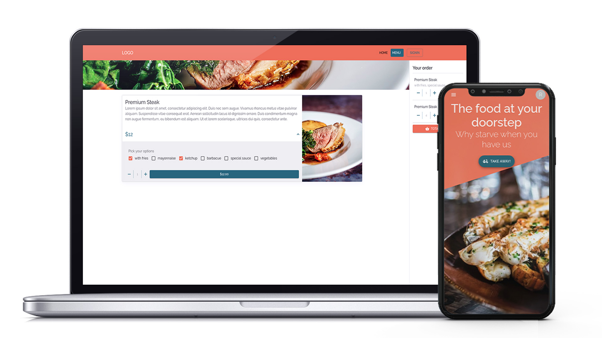

# Food Delivery App

You can test the app by clicking the following link -> <a href="https://food-delivery-3d3f4.web.app/">Live Preview</a>

## Technologies

  <table>
<tr>
    <td align="center"height="108px" width="108px">
      
       <strong>Typescript</strong>
    </td>
    <td align="center"height="108px" width="108px">
      
       <strong>JavaScript</strong>
    </td>
    <td align="center"height="108px" width="108px">
      
       <strong>React</strong>
    </td>
        <td align="center" height="108px" width="108px">
      
       <strong>HTML5</strong>
    </td>
        <td align="center"height="108px" width="108px">
      
       <strong>CSS3</strong>
    </td>
        <td align="center"height="108px" width="108px">
      
       <strong>MaterialUI</strong>
    </td>
        <td align="center" height="108" width="108">
      
       <strong>Firebase</strong>
    </td>
</tr>
</table>

## Features

Food delivery app which I created to learn Typescript and MaterialUI. Typescript it's wild but it's a tool that provides me security while writing code and it can be used as documentation to know in each step what are you passing to your components.

In this app you can order the food you want, with their own options such different kind of sauces.

## Planned features

- [ ] Admin Dashboard
    - [ ] Handle orders from an admin account
    - [ ] Sales report in graphic's form
- [ ] User Dashboard
    - [ ] The user will be able to change his address.
    - [ ] Orders page to see the status of the order along the previous orders that the user has made.